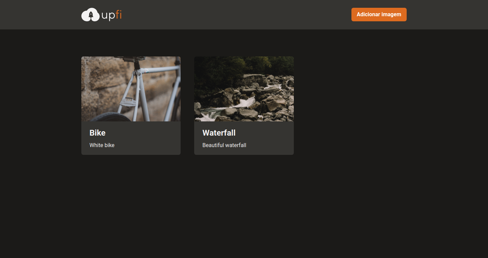

# next-img-upload

<p align="center">
  
</p>

<h2 align="center">
  A image host application build with Next.JS, Chakra UI, FaunaDB and Typescript.
</h2>

<p align="center">
  <a href="#computer-features">Features</a>&nbsp;&nbsp;|&nbsp;&nbsp;
  <a href="#keyboard-technologies">Technologies</a>&nbsp;&nbsp;|&nbsp;&nbsp;
  <a href="#computer_mouse-installation">Installation</a>
</p>

<p align="center">
  

  

  <a href="https://github.com/areasflavio/next-img-upload/commits/master">
    
  </a>
</p>

<br/>





<br/>

# :computer: Features

This is a simple image host app. Send your images to the cloud.

Some key features are:

- Functional application with Next.JS.
- UI built with ChakraUI.
- Images host at ImgBB.
- Data are stored in FaunaDB.
- API requesta are made with React Query.
- Intuitive upload form handle by React Hook Form.

The application is built using ReactJS with Next.JS framework. Data is provided
by the own Next.JS Serverless API. The user interface is built with the amazing
ChakraUI declarative component library. The entire codebase is written using
Typescript.

> Project developed as a challenge for Chapter IV of Rocketseat's Ignite bootcamp.

<p align="center">
  You can also check out the <a href="https://next-img-upload.vercel.app">full version</a>
  of the hosted application at:
</p>
<p align="center">
    
</p>

[(Back to top)](#next-img-upload)

<br/>

# :keyboard: Technologies

[(Back to top)](#next-img-upload)

This is what i used and learned with this project:

- [x] ReactJS
- [x] Next.JS
- [x] Chakra UI
- [x] FaunaDB
- [x] ImgBB
- [x] Multer
- [x] React Hook Form
- [x] Yup
- [x] React Icons
- [x] React Query
- [x] Axios
- [x] Eslint
- [x] Prettier
- [x] Typescript

<br/>

# :computer_mouse: Installation

[(Back to top)](#next-img-upload)

To use this project, first you need NodeJS running in your device, then you can
follow the commands below:

```bash
# Clone this repository
git clone https://github.com/areasflavio/next-img-upload.git

# Go into the repository
cd next-img-upload

# Install dependencies for the application
yarn install

# Copy the .env.example to the .env.local file and inject your credentials
cp .env.example .env.local

# To start the development server, run the following command
yarn dev
```

# :man_technologist: Author

[(Back to top)](#next-img-upload)

Build by Flávio Arêas 👋 [Get in touch!](https://www.linkedin.com/in/areasflavio/)
